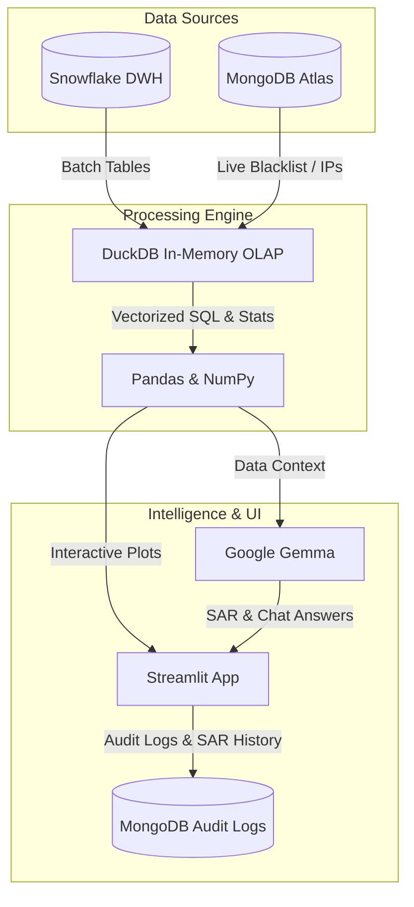

# Financial Fraud & Scam Detection Network
> **Real-time Graph Analytics & Intelligent Data Pipeline Integrated with a GenAI-Powered Forensic Copilot.**
> Designed for Financial Intelligence Units (FIUs), risk compliance officers, and cybersecurity teams to detect, trace, and investigate complex financial crimes.

## 📺 Demo / วิดีโอสาธิตการทำงาน

สามารถรับชมวิดีโออธิบายการทำงานของแอปพลิเคชันได้ที่นี่:
[ชมวิดีโอบน YouTube](https://youtu.be/frMWkFCovSw)

### Members
1. Thiti Chaiwiwatthanan 6810412003
2. Tirawat Kongjinda     6810412005

## Content 
-  [***Issues and Motivation***](https://github.com/lynxe585/streamlit_project/tree/main#-issues--motivation)
-  [***Objectives***](https://github.com/lynxe585/streamlit_project/tree/main#-objectives)
-  [***System Pipeline Architecture***](https://github.com/lynxe585/streamlit_project/tree/main#-tech-stack--architecture)
-  [***Solution & Methodology***](https://github.com/lynxe585/streamlit_project/tree/main#-solution--methodology)
-  [***Visualizations***](https://github.com/lynxe585/streamlit_project/tree/main#-visualizations)
-  [***Tutorial using streamlit***](https://github.com/lynxe585/streamlit_project/tree/main#-tutorial-using-streamlit) 

---

## 🚨 Issues & Motivation

In today’s highly digitized and borderless economy, financial crimes have evolved into structured, decentralized networks. Traditional rule-based detection systems fall short due to:
* **Mule Account Networks & Circular Laundering:** Fraud syndicates actively split, layer, and route illicit funds through multiple compromised accounts, often cycling money back to origin points. Analyzing transactions in isolation fails to map these complex loops.
* **Alert Fatigue (High False Positives):** Legacy systems produce excessive false alarms, overwhelming investigators and delaying critical response times to actual threats.
* **Lack of Explainability:** Even when advanced ML models flag suspicious activities, investigators struggle to understand *why* the transaction was flagged, slowing down the drafting of official Suspicious Activity Reports (SARs).

---

## 🎯 Objectives

1. **Network & Relationship Mapping:** Connect the dots between seemingly unrelated accounts, IP addresses, and Device IDs to visually reveal money laundering syndicates and detect multi-hop circular loops ($A \rightarrow B \rightarrow A$ or $A \rightarrow B \rightarrow C \rightarrow A$).
2. **High-Performance Analytics:** Leverage Snowflake and MongoDB Atlas combined with in-memory DuckDB to aggregate and query millions of transaction records with sub-second latency.
3. **GenAI Forensic Automation:** Deploy an AI Copilot (Gemma/Gemini) that automatically audits transaction logs, explains complex routing trails in plain language, and drafts compliance-ready SARs in both Thai and English.

---

## 🛠️ Tech Stack & Architecture

| Component | Technology | Role in Project |
| :--- | :--- | :--- |
| **Frontend** | [Streamlit](https://streamlit.io/) | Multi-page interactive analytical web application |
| **OLAP Engine** | [DuckDB](https://duckdb.org/) | In-memory vectorized processing for lightning-fast SQL queries |
| **Warehouse** | [Snowflake](https://www.snowflake.com/) | Cloud data warehouse sourcing historical fraud data |
| **Live Database** | [MongoDB Atlas](https://www.mongodb.com/) | Live NoSQL store for Blacklist feeds, IP/Device mappings, and Audit logs |
| **GenAI LLM** | [Google Gemma](https://ai.google.dev/) | Contextual SAR generator and database-centric Q&A Chatbot |
| **Visualization**| [Plotly](https://plotly.com/) | Dynamic charts, geospatial bubble maps, and money flow diagrams |
| **Processing** | Pandas & NumPy | High-performance data wrangling and mathematical risk indexing |

### System Pipeline Architecture

## 💡 Solution & Methodology

### 1. Non-AI Engine (Engineering & Statistics)
* **In-Memory OLAP Queries (DuckDB):** Performs vectorized SQL operations to handle deep data filtering, aggregation, and calculate transaction risk metrics instantaneously.
* **Circular Loop Detection (Self-Joins):** Employs graph traversal strategies using SQL self-joins to detect laundering cycles:
  * **2-Hop Loops:** Direct circular transfers ($A \rightarrow B \rightarrow A$)
  * **3-Hop Loops:** Layered circular transfers ($A \rightarrow B \rightarrow C \rightarrow A$)
* **Velocity & Burst Fraud Detection:** Audits accounts for high-frequency transfers within a 24-hour window (detecting Card Testing or Account Takeovers) by measuring transaction rates against daily burst thresholds.
* **Statistical Anomaly Detection:** Applies Interquartile Range (IQR) calculations on transaction amounts to isolate statistical outliers from normal spending behaviors.
* **Multi-Source Database Integration:** Syncs batch historical records from Snowflake with real-time blacklists, login footprints (Device IDs & IPs), and investigator actions (Audit logs) managed on MongoDB Atlas.

### 2. GenAI Integration (Forensics & Automation)
* **GenAI Prompt Contextualization:** Feeds transaction logs (top 30 records) along with network metadata and investigator prompts into the LLM context.
* **SAR Generator:** Automatically generates forensic investigation reports in Thai/English. The model evaluates entity roles (e.g., Mule Account, Shell Company, or Retail Account), points out explicit red flags, and recommends actionable steps (e.g., freeze outbound transactions, request UBO verification).
* **GenAI Chatbot (AI Database Agent):** Allows investigators to interactively query an account's transaction log using natural language (e.g., *"Who transferred the highest volume to this account?"*) and logs chat history directly to MongoDB Audit Logs for compliance.

---

## 📊 Visualizations

* **Executive KPI Cards:** Dynamic business ROI tracking (Value Saved vs Actual Loss) and overall system risk indices.
* **Daily Transaction Trend (Plotly Line Chart):** Interactive visualization of daily transaction volumes alongside high-risk activity trends.
* **Scam Typologies Distribution (Plotly Bar & Funnel Chart):** Shows the distribution of transaction counts and volumes across scam categories (Phishing, Romance Scam, Investment Scam, etc.).
* **Geographic Risk Map (Plotly Scatter Geo):** Visualizes geographical threat distributions using bubble size and color to denote transaction volumes and risk metrics.
* **Amount Anomaly Plots (Plotly Box/Violin Plots):** Exposes statistical outliers by comparing normal transaction ranges with flagged transactions.
* **Circular Loop Network Graph:** Illustrates nodes in a circular transaction flow (red nodes denote loop participants, and line thickness indicates transfer sizes).
* **Sankey Money Flow Diagram (Plotly Sankey):** Maps the distribution of fund flows from the investigated account to various counterparties. Flow lines are color-coded based on risk scores (Red for high-risk $\ge$ 70%, Amber for medium, Blue for low).

## 🎬 Tutorial Using Streamlit

